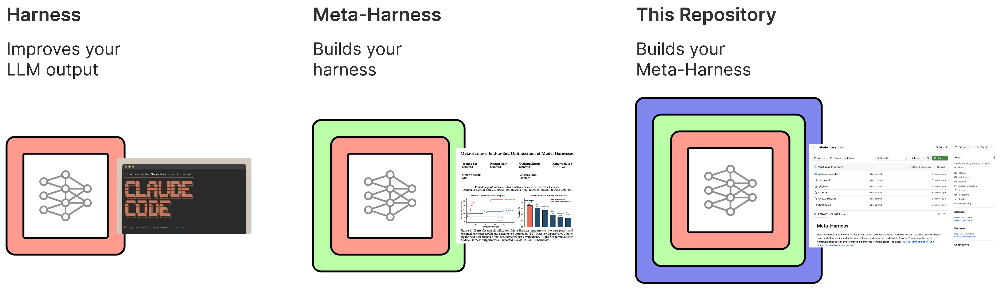

# Meta-Harness



Meta-Harness is a framework for automated search over task-specific model harnesses: the code around a fixed base model that decides what to store, retrieve, and show while the model works. This repo contains the framework and two reference experiments from the paper.
The paper is [Meta-Harness: End-to-End Optimization of Model Harnesses](https://arxiv.org/abs/2603.28052).

**If you end up building something cool with Meta-Harness, please let us know!** We would be happy to showcase it here in the main README and link to your repository, artifact, blog post, paper, or whatever else is most useful.

## Contents

- The reusable framework and onboarding flow for applying Meta-Harness to a new domain.
- Two paper reference experiments under `reference_examples/`:
  - [`reference_examples/text_classification/`](reference_examples/text_classification/README.md): memory-system search for text classification.
  - [`reference_examples/terminal_bench_2/`](reference_examples/terminal_bench_2/README.md): scaffold evolution for Terminal-Bench 2.0.
- The optimized Terminal-Bench 2 harness from the paper lives in the separate artifact repo: [stanford-iris-lab/meta-harness-tbench2-artifact](https://github.com/stanford-iris-lab/meta-harness-tbench2-artifact).

## Quick Start

Text classification:

```bash
cd reference_examples/text_classification
uv sync
uv run python meta_harness.py --iterations 1
```

Terminal-Bench 2 smoke task:

```bash
cd reference_examples/terminal_bench_2
uv sync
uv run bash scripts/run_eval.sh agents.baseline_kira:AgentHarness full 1 1 -i extract-elf
```

Use the subdir READMEs for setup details, expected runtime, and additional commands.

## Applying Meta-Harness To A New Domain

Start by pointing your coding assistant to [`ONBOARDING.md`](ONBOARDING.md) and having a conversation with it.
This should produce a `domain_spec.md` file with concrete details on how to proceed with implementing Meta-Harness for your domain.

The shipped examples currently assume Claude Code as the proposer agent. To use a different proposer agent, adapt the example `claude_wrapper.py` scripts in [`reference_examples/text_classification/claude_wrapper.py`](reference_examples/text_classification/claude_wrapper.py) or [`reference_examples/terminal_bench_2/claude_wrapper.py`](reference_examples/terminal_bench_2/claude_wrapper.py). The main requirement is a wrapper that cleanly logs proposer interactions.

## Release Note

This is a cleaned up version of the code we used for the paper. It has not been tested beyond verifying that it runs. Please let us know if anything goes wrong.

## Citation

If this repository is useful for your research, please cite the paper:

```bibtex
@misc{lee2026metaharnessendtoendoptimizationmodel,
      title={Meta-Harness: End-to-End Optimization of Model Harnesses},
      author={Yoonho Lee and Roshen Nair and Qizheng Zhang and Kangwook Lee and Omar Khattab and Chelsea Finn},
      year={2026},
      eprint={2603.28052},
      archivePrefix={arXiv},
      primaryClass={cs.AI},
      url={https://arxiv.org/abs/2603.28052},
}
```
