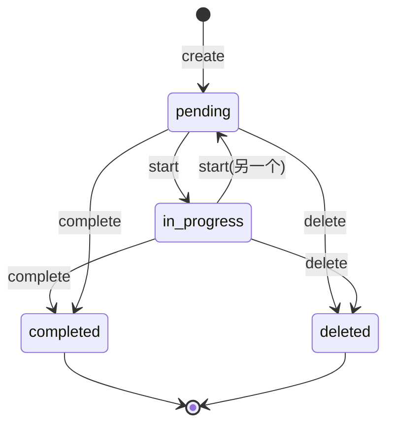

# SPEC03 — Todo 工具 (任务进度跟踪)

> 对应需求文档: PRD04.md — 任务进度跟踪
> 创建日期: 2026-04-18

---

## 1. 目标

为 Flux 新增 `todo` 工具，解决多步任务中模型丢失进度的问题。通过持久化的任务列表跟踪进度，并在模型长时间不使用时自动提醒。

---

## 2. 问题分析

| 现象 | 根因 |
|------|------|
| 重复做过的事 | 任务状态未被记录，模型依赖上下文记忆 |
| 跳步 | 模型看不到完整任务列表 |
| 跑偏 | 对话越长，系统提示影响力被稀释 |
| 10 步重构只做 1-3 步 | 工具结果占用上下文，后续步骤被挤出注意力 |

---

## 3. 设计原则

| 原则 | 说明 |
|------|------|
| 状态持久化 | 任务状态保存在内存中，跨越整个对话会话 |
| 单一 in_progress | 同时只有一个任务处于进行中状态 |
| 自动转换 | 开始任务时自动将前一个 in_progress 标记为 pending |
| 简洁优先 | 默认列表只显示必要信息，详细信息按需获取 |
| 幂等操作 | 重复完成同一任务不会报错 |
| 自动提醒 | 连续 N 轮未调用 todo 时注入系统提示提醒 |

---

## 4. 数据结构

### 4.1 任务项结构

```python
@dataclass
class TodoItem:
    id: str                    # UUID v4
    subject: str               # 简短标题 ( imperative 形式 )
    description: str           # 详细描述
    status: Literal["pending", "in_progress", "completed", "deleted"]
    created_at: float          # unix timestamp
    updated_at: float          # unix timestamp
```

### 4.2 Todo 状态

```python
class TodoState:
    """任务状态管理器，挂载在 Agent 实例上。"""

    items: list[TodoItem]
    _last_todo_call: int  # 上次调用 todo 的轮次计数
    _current_iteration: int  # 当前 Agent 迭代轮次
```

---

## 5. 工具 API 设计

### 5.1 TodoTool 参数

| 操作 | action | 参数 | 说明 |
|------|--------|------|------|
| 创建 | create | subject, description | 新建任务，status=pending |
| 开始 | start | task_id | 标记为 in_progress，前一个 in_progress → pending |
| 更新 | update | task_id, subject?, description? | 修改任务内容 |
| 完成 | complete | task_id | status → completed |
| 删除 | delete | task_id | status → deleted |
| 列表 | list | (无) | 返回所有未删除任务 |

### 5.2 JSON Schema

```python
parameters = {
    "type": "object",
    "properties": {
        "action": {
            "type": "string",
            "enum": ["create", "start", "update", "complete", "delete", "list"],
            "description": "The action to perform on todos"
        },
        "task_id": {
            "type": "string",
            "description": "UUID of the task to operate on (required for start/update/complete/delete)"
        },
        "subject": {
            "type": "string",
            "description": "Brief title for the task (required for create, optional for update)"
        },
        "description": {
            "type": "string",
            "description": "Detailed description of the task (optional for create/update)"
        },
    },
    "required": ["action"],
}
```

---

## 6. 行为规范

### 6.1 状态转换规则



### 6.2 输出格式

**list 操作输出：**
```
[Todo List]
(1) [in_progress] Implement auth system
    - Add login endpoint with JWT
(2) [pending] Write unit tests
    - Cover login, register, logout
(3) [completed] Design database schema
```

**其他操作输出：**
- `[Todo created: xxx] Implement auth system`
- `[Todo started: xxx] Implement auth system`
- `[Todo completed: xxx] Implement auth system`
- `[Todo deleted: xxx] Implement auth system`
- `[Error: task not found: xxx]`

### 6.3 Nag Reminder 机制

```python
# 在 Agent.run() 中
self._current_iteration += 1

if self._current_iteration - self._last_todo_call >= NAG_THRESHOLD:
    # 注入系统消息提醒
    reminder = {
        "role": "system",
        "content": (
            "[Reminder] You have active todos. "
            "Use the `todo` tool with action='list' to check progress, "
            "or `todo` with action='complete' when you finish a task."
        )
    }
    self.messages.append(reminder)
    self._last_todo_call = self._current_iteration  # 重置计数
```

**NAG_THRESHOLD 常量：** 默认 3，可通过配置调整

---

## 7. 文件变更清单

```
flux/
├── tools/
│   ├── todo.py           # [新增] TodoTool + TodoItem + TodoState
│   ├── base.py           # [不变]
│   ├── bash.py           # [不变]
│   ├── edit.py           # [不变]
│   ├── read.py           # [不变]
│   ├── registry.py       # [不变]
│   ├── write.py          # [不变]
│   └── __init__.py       # [修改] 导出 TodoTool
├── agent.py              # [修改] 集成 TodoState + nag reminder
├── cli.py                # [修改] 注册 TodoTool + 更新 SYSTEM_PROMPT
└── message.py            # [不变]

tests/
├── test_todo.py          # [新增] TodoTool 单元测试
└── test_agent.py         # [修改] 测试 nag reminder 逻辑
```

---

## 8. 实现细节

### 8.1 TodoTool (flux/tools/todo.py)

```python
import uuid
import time
from dataclasses import dataclass, field
from typing import Literal
from .base import Tool


@dataclass
class TodoItem:
    id: str
    subject: str
    description: str
    status: Literal["pending", "in_progress", "completed", "deleted"]
    created_at: float
    updated_at: float


class TodoState:
    """任务状态管理器。"""

    def __init__(self):
        self.items: list[TodoItem] = []
        self._last_todo_call = 0
        self._current_iteration = 0

    def advance_iteration(self):
        """前进一轮迭代。"""
        self._current_iteration += 1

    def record_todo_call(self):
        """记录一次 todo 工具调用。"""
        self._last_todo_call = self._current_iteration

    def should_nag(self, threshold: int = 3) -> bool:
        """检查是否需要发送提醒。"""
        return self._current_iteration - self._last_todo_call >= threshold

    def add(self, subject: str, description: str) -> TodoItem:
        item = TodoItem(
            id=str(uuid.uuid4())[:8],
            subject=subject,
            description=description,
            status="pending",
            created_at=time.time(),
            updated_at=time.time(),
        )
        self.items.append(item)
        return item

    def get(self, task_id: str) -> TodoItem | None:
        return next((i for i in self.items if i.id == task_id and i.status != "deleted"), None)

    def list_active(self) -> list[TodoItem]:
        return [i for i in self.items if i.status != "deleted"]

    def set_in_progress(self, task_id: str) -> TodoItem | None:
        # 先将所有 in_progress 设为 pending
        for i in self.items:
            if i.status == "in_progress":
                i.status = "pending"
                i.updated_at = time.time()
        # 设定新的 in_progress
        item = self.get(task_id)
        if item:
            item.status = "in_progress"
            item.updated_at = time.time()
        return item

    def update(self, task_id: str, **kwargs) -> TodoItem | None:
        item = self.get(task_id)
        if item:
            for k, v in kwargs.items():
                if hasattr(item, k) and v is not None:
                    setattr(item, k, v)
            item.updated_at = time.time()
        return item

    def set_status(self, task_id: str, status: str) -> TodoItem | None:
        item = self.get(task_id)
        if item:
            item.status = status
            item.updated_at = time.time()
        return item

    def format_list(self) -> str:
        active = self.list_active()
        if not active:
            return "[Todo List: empty]"

        lines = ["[Todo List]"]
        for i, item in enumerate(active, 1):
            status_icon = {"pending": " ", "in_progress": "*", "completed": "x"}
            icon = status_icon.get(item.status, "?")
            lines.append(f"({i}) [{icon}] {item.subject}")
            if item.description:
                for line in item.description.split("\n"):
                    lines.append(f"    {line}")
        return "\n".join(lines)


class TodoTool(Tool):
    """任务进度跟踪工具。"""

    name = "todo"
    description = (
        "Manage task progress. Use to create, list, start, complete, or delete tasks. "
        "Only one task can be in_progress at a time. "
        "Actions: create (requires subject, optional description), "
        "list (no params), start (requires task_id), "
        "complete (requires task_id), delete (requires task_id), "
        "update (requires task_id, optional subject/description)."
    )
    parameters = {
        "type": "object",
        "properties": {
            "action": {
                "type": "string",
                "enum": ["create", "start", "update", "complete", "delete", "list"],
            },
            "task_id": {"type": "string"},
            "subject": {"type": "string"},
            "description": {"type": "string"},
        },
        "required": ["action"],
    }

    def __init__(self, state: TodoState):
        self.state = state

    def execute(self, action: str, task_id: str = None, subject: str = None, description: str = None) -> str:
        self.state.record_todo_call()

        if action == "create":
            if not subject:
                return "[Error: 'create' action requires 'subject']"
            item = self.state.add(subject, description or "")
            return f"[Todo created: {item.id}] {item.subject}"

        elif action == "list":
            return self.state.format_list()

        elif action == "start":
            if not task_id:
                return "[Error: 'start' action requires 'task_id']"
            item = self.state.set_in_progress(task_id)
            if not item:
                return f"[Error: task not found: {task_id}]"
            return f"[Todo started: {item.id}] {item.subject}"

        elif action == "complete":
            if not task_id:
                return "[Error: 'complete' action requires 'task_id']"
            item = self.state.set_status(task_id, "completed")
            if not item:
                return f"[Error: task not found: {task_id}]"
            return f"[Todo completed: {item.id}] {item.subject}"

        elif action == "delete":
            if not task_id:
                return "[Error: 'delete' action requires 'task_id']"
            item = self.state.set_status(task_id, "deleted")
            if not item:
                return f"[Error: task not found: {task_id}]"
            return f"[Todo deleted: {item.id}] {item.subject}"

        elif action == "update":
            if not task_id:
                return "[Error: 'update' action requires 'task_id']"
            updates = {}
            if subject is not None:
                updates["subject"] = subject
            if description is not None:
                updates["description"] = description
            if not updates:
                return "[Error: 'update' requires at least one of 'subject' or 'description']"
            item = self.state.update(task_id, **updates)
            if not item:
                return f"[Error: task not found: {task_id}]"
            return f"[Todo updated: {item.id}] {item.subject}"

        return f"[Error: unknown action '{action}']"
```

### 8.2 Agent 修改 (flux/agent.py)

```python
# 在 Agent.__init__ 中添加
self.todo_state = TodoState()

# 在 Agent.run() 的 for 循环中，每次迭代开始时：
def run(self, user_query: str) -> str:
    self.messages.append({"role": "user", "content": user_query})

    for i in range(self.max_iterations):
        # 前进迭代计数
        self.todo_state.advance_iteration()

        # 检查是否需要 nag
        if self.todo_state.should_nag():
            self.messages.append({
                "role": "system",
                "content": (
                    "[Reminder] You have active todos. Use `todo` with action='list' to check progress. "
                    "Mark tasks complete with action='complete' when done."
                )
            })

        # ... 原有逻辑
```

### 8.3 CLI 修改 (flux/cli.py)

```python
from .tools.todo import TodoTool, TodoState

# 在 main() 中
todo_state = TodoState()
registry.register(TodoTool(state=todo_state))

# 更新 SYSTEM_PROMPT 添加 todo 工具说明
SYSTEM_PROMPT = """\
...
## Tools
- `bash` — Execute shell commands...
- `read` — Read file contents...
- `write` — Create or overwrite files...
- `edit` — Exact string replacement...
- `todo` — Track task progress. Use for multi-step tasks.

## Guidelines
...
**For multi-step tasks, use `todo` to track progress:**
1. Create tasks with `todo action='create' subject='...'`
2. Start a task with `todo action='start' task_id='...'`
3. Mark complete with `todo action='complete' task_id='...'`
4. List tasks with `todo action='list'`
...
"""
```

---

## 9. 测试计划

### 9.1 TodoTool 单元测试

```python
# tests/test_todo.py

class TestTodoState:
    def test_add_and_get(self):
        state = TodoState()
        item = state.add("Test task", "Description")
        assert state.get(item.id) == item
        assert item.status == "pending"

    def test_set_in_progress(self):
        state = TodoState()
        a = state.add("Task A", "")
        b = state.add("Task B", "")
        state.set_in_progress(a.id)
        assert state.get(a.id).status == "in_progress"
        state.set_in_progress(b.id)
        assert state.get(a.id).status == "pending"
        assert state.get(b.id).status == "in_progress"

    def test_list_active_excludes_deleted(self):
        state = TodoState()
        a = state.add("Task A", "")
        b = state.add("Task B", "")
        state.set_status(a.id, "deleted")
        assert state.list_active() == [state.get(b.id)]

    def test_should_nag(self):
        state = TodoState()
        assert not state.should_nag(threshold=3)
        state.advance_iteration()
        state.advance_iteration()
        state.advance_iteration()
        assert state.should_nag(threshold=3)
        state.record_todo_call()
        assert not state.should_nag(threshold=3)


class TestTodoTool:
    def test_create(self):
        state = TodoState()
        tool = TodoTool(state)
        result = tool.execute(action="create", subject="Test")
        assert "[Todo created:" in result
        assert "Test" in result
        assert len(state.items) == 1

    def test_create_requires_subject(self):
        state = TodoState()
        tool = TodoTool(state)
        result = tool.execute(action="create")
        assert "requires 'subject'" in result

    def test_list_empty(self):
        state = TodoState()
        tool = TodoTool(state)
        result = tool.execute(action="list")
        assert "empty" in result

    def test_list_with_items(self):
        state = TodoState()
        tool = TodoTool(state)
        state.add("Task A", "Desc A")
        state.set_in_progress(state.items[0].id)
        state.add("Task B", "Desc B")
        result = tool.execute(action="list")
        assert "[*] Task A" in result
        assert "[ ] Task B" in result
        assert "Desc A" in result

    def test_start(self):
        state = TodoState()
        tool = TodoTool(state)
        state.add("Task A", "")
        task_id = state.items[0].id
        result = tool.execute(action="start", task_id=task_id)
        assert "[Todo started:" in result
        assert state.get(task_id).status == "in_progress"

    def test_complete(self):
        state = TodoState()
        tool = TodoTool(state)
        state.add("Task A", "")
        task_id = state.items[0].id
        result = tool.execute(action="complete", task_id=task_id)
        assert "[Todo completed:" in result
        assert state.get(task_id).status == "completed"

    def test_delete(self):
        state = TodoState()
        tool = TodoTool(state)
        state.add("Task A", "")
        task_id = state.items[0].id
        result = tool.execute(action="delete", task_id=task_id)
        assert "[Todo deleted:" in result
        assert state.get(task_id) is None

    def test_update(self):
        state = TodoState()
        tool = TodoTool(state)
        state.add("Task A", "Old desc")
        task_id = state.items[0].id
        result = tool.execute(
            action="update",
            task_id=task_id,
            subject="Task B",
            description="New desc"
        )
        assert "[Todo updated:" in result
        item = state.get(task_id)
        assert item.subject == "Task B"
        assert item.description == "New desc"

    def test_unknown_action(self):
        state = TodoState()
        tool = TodoTool(state)
        result = tool.execute(action="invalid")
        assert "unknown action" in result
```

### 9.2 Agent 集成测试

```python
# tests/test_agent.py 新增测试

class TestAgentTodoIntegration:
    def test_nag_reminder_injected(self, mock_llm):
        """验证连续 N 轮不调用 todo 时注入提醒。"""
        state = TodoState()
        state.add("Test task", "")
        registry = ToolRegistry()
        registry.register(TodoTool(state))

        agent = Agent(
            llm=mock_llm,
            tools=registry,
            system_prompt="Test",
            todo_state=state,
        )

        # 模拟多轮不调用 todo
        for _ in range(4):
            state.advance_iteration()

        assert state.should_nag(threshold=3)

    def test_todo_call_resets_nag(self, mock_llm):
        """验证调用 todo 后重置 nag 计数。"""
        state = TodoState()
        state.add("Test task", "")
        registry = ToolRegistry()
        registry.register(TodoTool(state))

        agent = Agent(
            llm=mock_llm,
            tools=registry,
            system_prompt="Test",
            todo_state=state,
        )

        state.advance_iteration()
        state.advance_iteration()
        state.record_todo_call()  # 调用 todo
        state.advance_iteration()

        assert not state.should_nag(threshold=3)
```

---

## 10. 配置选项

在 `config.py` 中新增配置项：

```python
@dataclass
class Config:
    # ... 现有配置
    nag_threshold: int = 3  # Nag reminder 触发阈值（轮次）
```

---

## 11. 实现顺序

1. **第一步**：实现 `TodoTool` + `TodoState`，编写单元测试
2. **第二步**：修改 `Agent` 集成 `TodoState` 和 nag reminder
3. **第三步**：修改 `CLI` 注册工具并更新系统提示
4. **第四步**：编写集成测试
5. **第五步**：端到端测试验证完整流程
